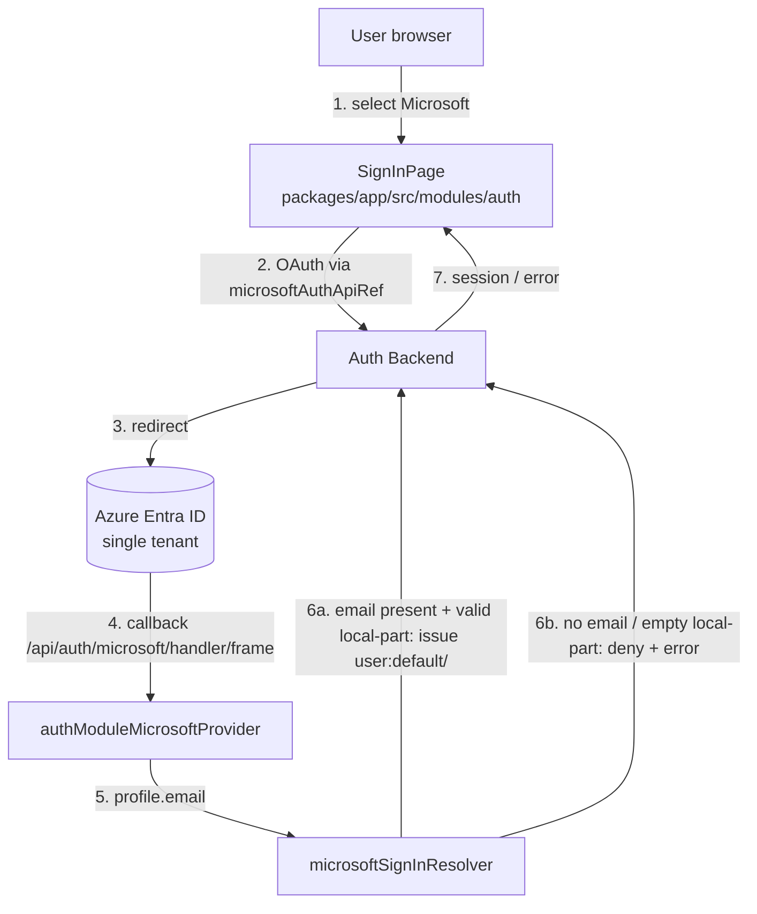

# Design Document

## Overview

This feature adds **Microsoft Azure Entra ID** OAuth sign-in alongside the existing `guest` and
`github` providers, scoped as a POC. It follows the auth pattern already established in this repo
for the GitHub provider, so Microsoft becomes a parallel third option rather than a restructuring.

The feature has four parts:

| # | Part | Requirement |
| --- | --- | --- |
| 1 | Backend provider registration | R1 |
| 2 | Config: env-referenced values + single-tenant | R2 |
| 3 | Custom resolver: email local-part → identity (trust-the-IdP) | R3 |
| 4 | Frontend option + README docs | R4, R5 |

The only non-trivial logic is the sign-in resolver. Its email-to-identity derivation is factored
into a pure helper (`deriveMicrosoftUserRef`) so it is unit- and property-testable in isolation;
the config, wiring, and frontend parts are covered by config-shape assertions, a module smoke
test, and a render test.

## Alignment with the existing GitHub provider

This repo already implements a custom GitHub OAuth provider with a code-defined resolver
(`packages/backend/src/authModuleGithubProvider.ts`, `githubSignInResolver.ts`, and the frontend
option in `packages/app/src/modules/auth/SignInPage.tsx`). Microsoft mirrors that structure
one-for-one:

| Concern | GitHub (existing) | Microsoft (new) |
| --- | --- | --- |
| Backend module | `authModuleGithubProvider.ts` | `authModuleMicrosoftProvider.ts` |
| Pure resolver logic | `githubSignInResolver.ts` | `microsoftSignInResolver.ts` |
| Authenticator | `githubAuthenticator` | `microsoftAuthenticator` |
| Frontend apiRef | `githubAuthApiRef` | `microsoftAuthApiRef` |
| **Identity model** | deny unless catalog `User` matches | **trust-the-IdP: derive from email local-part** |

The single deliberate divergence is the **identity model**: GitHub denies sign-in unless a
matching `User` entity exists; the Microsoft POC issues an identity for any authenticated
in-tenant user, derived from the email local-part, without a catalog lookup. That is the point a
future iteration would revisit.

## Research findings (verified against repo versions)

- `@backstage/plugin-auth-backend@^0.30.0`, `@backstage/plugin-auth-node@^0.7.4` (provides
  `createOAuthProviderFactory`, `SignInResolver`).
- **New dependency:** `@backstage/plugin-auth-backend-module-microsoft-provider` (provides
  `microsoftAuthenticator`) → added to `packages/backend/package.json`.
- `microsoftAuthApiRef` is exported from `@backstage/core-plugin-api` (the same package as the
  `githubAuthApiRef` already imported) → **no new frontend package** is required.

Findings that shaped the design (sourced from the official Backstage docs, rephrased):

| Topic | Finding |
| --- | --- |
| Single-tenant scope | The provider accepts `clientId`/`clientSecret`/`tenantId` under `auth.providers.microsoft.<env>`; a concrete `tenantId` scopes sign-in to that one directory. |
| Callback URL | Local dev Redirect URI is `http://localhost:7007/api/auth/microsoft/handler/frame`, derived from backend `baseUrl`. |
| Built-in resolvers | `emailLocalPartMatchingUserEntityName` requires a matching `User` entity and throws `NotFoundError` when none exists — i.e. deny-on-no-match, not trust-the-IdP. |
| Issuing without an entity | A custom `SignInResolver` can call `ctx.issueToken({ claims: { sub, ent } })` with a self-constructed `userEntityRef`, issuing an identity with no catalog lookup. |

**Decision — custom resolver, not built-in.** Requirement 3 needs an identity issued for any
authenticated in-tenant user *without* a pre-existing `User` entity; the built-in resolver denies
in that case. So the design uses a **custom code-defined resolver** that derives
`user:default/<email-local-part>` and issues the token directly. When a resolver is defined in
code, the `app-config` `signIn.resolvers` list is omitted for the provider (config resolvers take
priority over code), keeping the resolver decision in one place — the same convention the GitHub
module documents.

## Architecture



### Component responsibilities

| Layer | Component | Responsibility | Req |
| --- | --- | --- | --- |
| Backend | `plugin-auth-backend` | Hosts providers; exposes the provider endpoint | 1.3 |
| Backend | Registration in `index.ts` | Adds `authModuleMicrosoftProvider` | 1.1, 1.2 |
| Backend | `authModuleMicrosoftProvider.ts` | Builds the provider (`createOAuthProviderFactory` + `microsoftAuthenticator`), wires the resolver; never reads/logs secrets | 1.1, 1.5, 3.1 |
| Backend | `microsoftSignInResolver.ts` | Derives `user:default/<local-part>`; enforces email-present / non-empty rules | 3.2–3.6 |
| Config | `app-config.yaml` (`development`) | Env-referenced 3 fields | 2.1, 2.2, 2.4, 2.5 |
| Config | `app-config.production.yaml` (`production`) | Same, under `production` key | 2.3, 2.4, 2.5 |
| Frontend | `SignInPage.tsx` | Adds the Microsoft option | 4.1–4.5 |
| Docs | README env table | Documents the three `AZURE_*` variables | 5.1–5.5 |

### Environment selection & startup

- `auth.environment` selects the active block. The repo already sets `development` (base config)
  and `production` (override), so the `microsoft` block is added under the matching key in each
  file.
- A missing/unresolvable `${AZURE_*}` reference surfaces a config error rather than starting the
  provider with an empty value (1.4, 2.6).
- The `guest` and `github` registrations and blocks are retained, so they keep working in parallel
  (1.2, 2.5, 4.2).

## Components & Interfaces

### 1. `packages/backend/src/index.ts`

Verified current state: registers auth-backend, the guest module, and `authModuleGithubProvider`.
The Microsoft module is added on the same pattern, right after the GitHub line:

```typescript
import { authModuleMicrosoftProvider } from './authModuleMicrosoftProvider';
// ...
backend.add(authModuleGithubProvider);
backend.add(authModuleMicrosoftProvider); // added
```

### 2. `authModuleMicrosoftProvider.ts`

Mirrors `authModuleGithubProvider.ts`:

- `createBackendModule` with `pluginId: 'auth'`, `moduleId: 'microsoft-provider'`, registering
  `providerId: 'microsoft'`.
- Built with `createOAuthProviderFactory({ authenticator: microsoftAuthenticator, signInResolver })`.
- Does not read or log `AZURE_*` (1.5). Needs **no** catalog dependency, since the resolver does
  not query the catalog.

### 3. `microsoftSignInResolver.ts`

The derivation — the part that varies with input — is a pure helper, testable independently of
OAuth and token machinery:

```typescript
type DeriveOutcome =
  | { kind: 'ok'; userRef: string }   // user:default/<local-part>
  | { kind: 'no-email' }
  | { kind: 'empty-local-part' };

// lower-case → substring before first '@' → strip chars outside [a-z0-9+_.-]
function deriveMicrosoftUserRef(email: string | undefined): DeriveOutcome;
```

The surrounding resolver maps each outcome to either an issued token (empty ownership, 3.6) or a
specific denial error:

| Input condition | Behavior | Req |
| --- | --- | --- |
| Email present, non-empty sanitized local-part | Issue `user:default/<local-part>`, empty ownership | 3.2, 3.3, 3.6 |
| No email | Deny; no identity/session; error "profile has no email" | 3.4 |
| Empty local-part | Deny; no identity/session; error "could not derive identity from email" | 3.5 |

### 4. Configuration

`app-config.yaml` (`development`):

```yaml
auth:
  environment: development
  providers:
    guest: {}          # retained (R2.5)
    github:            # retained (R2.5)
      development:
        clientId: ${GITHUB_CLIENT_ID}
        clientSecret: ${GITHUB_CLIENT_SECRET}
    microsoft:
      development:
        clientId: ${AZURE_CLIENT_ID}
        clientSecret: ${AZURE_CLIENT_SECRET}
        tenantId: ${AZURE_TENANT_ID}
        # signIn.resolvers intentionally omitted: the custom code resolver takes priority.
```

`app-config.production.yaml`: the same `microsoft` block under a `production` key, alongside the
retained `guest` and `github` blocks. Only `${...}` references appear; no literal values (2.4).

### 5. `SignInPage.tsx`

Verified current state: `providers` is `['guest', { id: 'github-auth-provider', …, apiRef:
githubAuthApiRef }]`. A third entry is appended:

```typescript
import { githubAuthApiRef, microsoftAuthApiRef } from '@backstage/core-plugin-api';

const providers: IdentityProviders = [
  'guest',
  { id: 'github-auth-provider', title: 'GitHub', message: 'Sign in using GitHub', apiRef: githubAuthApiRef },
  { id: 'microsoft-auth-provider', title: 'Microsoft', message: 'Sign in using Azure Entra ID', apiRef: microsoftAuthApiRef },
];
```

`index.ts` (the `SignInPageBlueprint` registration) is unchanged. The App Registration must have
`http://localhost:7007/api/auth/microsoft/handler/frame` as a Redirect URI.

### 6. README

Add three rows to the Environment variables table and extend the "do not commit real values" note
to cover the new secret:

| Variable | Purpose | Used in |
| --- | --- | --- |
| `AZURE_CLIENT_ID` | Identifies the Entra ID App Registration used for Microsoft sign-in | `app-config.yaml`, `app-config.production.yaml` |
| `AZURE_CLIENT_SECRET` | Authenticates the Entra ID App Registration used for Microsoft sign-in | `app-config.yaml`, `app-config.production.yaml` |
| `AZURE_TENANT_ID` | Scopes Microsoft sign-in to a single Entra ID tenant | `app-config.yaml`, `app-config.production.yaml` |

## Data Models

**Microsoft profile (relevant subset):** `email: string | undefined` — the sole input to identity
derivation.

**Backstage identity (resolver output):**

| Field | Value |
| --- | --- |
| `userEntityRef` | `user:default/<local-part>` (e.g. `user:default/jane.doe`) |
| ownership refs | empty (POC, R3.6) |

**Derivation outcome model:**

| Outcome | Meaning | Result |
| --- | --- | --- |
| `ok` | Email present, valid local-part | Issue identity + empty ownership |
| `no-email` | Profile carries no email | Deny + "profile has no email" |
| `empty-local-part` | Local-part empty after sanitization | Deny + "could not derive identity from email" |

Example derivations (placeholder emails only, never real people):

| Email | Local-part | userEntityRef |
| --- | --- | --- |
| `jane.doe@example.com` | `jane.doe` | `user:default/jane.doe` |
| `Jane.Doe@Example.com` | `jane.doe` | `user:default/jane.doe` (lower-cased) |
| `alice@example.com` | `alice` | `user:default/alice` |
| (missing) | — | deny (`no-email`) |

## Correctness Properties

*A property is a statement about behavior that should hold across all valid executions.*

PBT applies only to the pure helper `deriveMicrosoftUserRef(email)` — its behavior varies with
casing, presence of `@`, characters outside the allowed set, and empty local-parts, so randomized
inputs find edge cases fixed examples miss. The rest (R1 wiring, R2 config, R4 UI, R5 docs) is not
suitable for PBT and is covered by smoke/example/render tests.

**Property 1 — outcome determined by email presence and sanitized local-part** (Req 3.2–3.5)
For all email inputs (including `undefined`, no-`@`, mixed case, and out-of-set characters),
`deriveMicrosoftUserRef` returns `no-email` iff the input is absent/empty; `empty-local-part` iff
the sanitized local-part is empty; otherwise `ok` with `userRef = 'user:default/' + <lowercased
sanitized local-part>`. It never produces a `userRef` outside `user:default/[a-z0-9+_.-]+`.

**Property 2 — case-insensitive and deterministic** (Req 3.2, 3.3)
For all emails, changing only letter-case of the input does not change the outcome kind, and `ok`
outcomes produce the same lower-cased `userRef`; calling twice with equal inputs yields the same
outcome.

## Error Handling

| Condition | Detection | Handling | Req |
| --- | --- | --- | --- |
| `AZURE_*` unset/unresolved at startup | Config resolution of `${...}` reference | Surface a config error naming the missing variable; do not start with an empty value | 1.4, 2.6 |
| Profile has no email | Resolver `no-email` outcome | Deny; no identity/session; "profile has no email" error | 3.4 |
| Empty local-part | Resolver `empty-local-part` outcome | Deny; no identity/session; "could not derive identity" error | 3.5 |
| OAuth fails/cancels, or resolver denies | OAuth result / auth error to the frontend | Deny session; return to sign-in page; show error | 4.5 |

- Denials are strict: no identity is issued and no session established.
- The guest and GitHub providers are unaffected by Microsoft-provider errors.
- `AZURE_*` values are never logged; error messages reference the variable **name** only.

## Testing Strategy

Fixtures use placeholder emails (`jane.doe@example.com`, `alice@example.com`) — never real
individuals.

**Property-based tests (derivation helper only)**
- Library: `fast-check` (standard for the Jest runner used by `@backstage/cli`); ≥100 iterations
  per property (`fc.assert(..., { numRuns: 100 })`).
- Generators: emails with mixed case, missing `@`, `undefined`, empty local-part, out-of-set
  characters.
- Tag each test: `Feature: azure-entraid-login, Property {n}: {text}`. Property 1 → one test,
  Property 2 → one test.

**Unit / example tests**
- Derivation examples: `jane.doe@example.com` → `user:default/jane.doe`; mixed case lower-cased;
  missing email → `no-email`; degenerate email → `empty-local-part` (3.2–3.5).
- `authModuleMicrosoftProvider.test.ts` (mirrors the GitHub module test): asserts registration of
  `providerId: 'microsoft'` / `pluginId: 'auth'` and that init does not throw (1.1).
- Config shape: parse both config files; assert the `microsoft` blocks under the correct env keys,
  the three fields as exact `${AZURE_*}` references, and retained `guest`/`github` blocks
  (2.1–2.3, 2.5).
- No-literal scan across all `app-config*` files: Azure fields match only the `${...}` form (2.4).
- `SignInPage.test.tsx` (extended): assert all three options (guest, GitHub, Microsoft) are
  present and selectable, keeping the existing assertions (4.1, 4.2).
- README content: three rows with all columns populated and the specified Purpose text (5.1–5.3);
  statement that the values come from an App Registration (5.4); note covers `AZURE_CLIENT_SECRET`
  (5.5).

**Integration / smoke tests**
- Backend boots with guest, GitHub, and Microsoft providers registered (1.1, 1.2, 3.1).
- The `microsoft` provider endpoint responds (not 404) after startup (1.3).
- No test performs a live Entra ID OAuth exchange or uses real credentials in CI (per AGENTS.md
  and Non-Goals); the OAuth exchange is mocked/stubbed where exercised.

**Balance:** property tests own the resolver's derivation across many inputs; unit/example tests
own config shape, module registration, docs, and the UI option set; integration/smoke tests own
wiring and endpoint availability. This avoids over-testing deterministic config with random
inputs.
