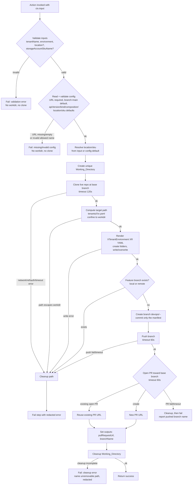

# Design Document

## Overview

Implements the `tenant:provision-crossplane` custom Backstage scaffolder action in a new backend
module `@internal/backstage-plugin-platform-backend-module-tenant-provisioning-crossplane`
(`plugins/platform-backend-module-tenant-provisioning-crossplane/`). It is a self-contained plugin
registered alongside the existing modules in `packages/backend/src/index.ts`.

Workflow (ends at the pull request):

1. Validate inputs; resolve Location / Storage_Account_Sku_Name against config defaults.
2. Clone the Crossplane live repo at the base branch into a per-execution temp working directory.
3. Render/write an `XTenantEnvironment` XR manifest at `tenants/<tenant>/<env>/xr.yaml`.
4. Create a timestamped feature branch; commit only that file; push.
5. Open (or reuse) a pull request.
6. Clean up the working directory.

> **Components disabled (retained for re-enable).** An earlier iteration expanded Selected_Components
> against Allowed_Components and rendered `spec.<component>.enabled` blocks. That path is retained in
> `components.ts`, config, and tests but **not emitted**: the renderer's emit loop is commented, the
> Template's `components` parameter/step input is commented, and the manifest carries no component
> blocks. Re-enable by uncommenting those marked seams.

**Hard boundary:** the action never runs `crossplane`, `kubectl apply`, or any cluster/cloud
execution — in production, tests, or CI (Req 5.5, `AGENTS.md`).

Requirement coverage: registration + input/config schema (Req 1), clone (Req 2), render + write
(Req 3), branch + commit (Req 4), push + PR idempotency (Req 5), cleanup (Req 6), secret protection +
tenant isolation (Req 7), fail-fast validation (Req 8), extensible components (Req 9).

## Module layout

Each unit has a single responsibility and is independently testable.

| File | Responsibility |
| --- | --- |
| `actions/tenantProvisionCrossplane.ts` | Action factory + orchestration handler |
| `config.ts` | Read/validate the `crossplaneProvisioning` config block |
| `manifest.ts` | Pure renderer → `XTenantEnvironment` XR YAML |
| `git.ts` | Clone/branch/commit/push (`isomorphic-git`), PR create/lookup (Octokit), `resolveLiveRepoToken`, error classification |
| `workspace.ts` | Per-execution temp dir: `mkdtemp` uniqueness, `resolveWithin` confinement, verified `cleanup` |
| `naming.ts` | `buildBranchName` (`devops/<tenant>-<env>-<yyyymmdd-hhmmss>`, UTC), `buildPullRequestTitle` |
| `redact.ts` | `redact` + `REDACTION_PLACEHOLDER` |
| `components.ts` | `expandComponents(selected, allowed)` |
| `module.ts` | Registers `tenant:provision-crossplane` (`moduleId: 'tenant-provisioning-crossplane'`) |
| `config.d.ts` | Schema declaration for the `crossplaneProvisioning` block |
| `index.ts` | Module export point |

## Research notes

- **Action registration.** `createBackendModule` depends on `scaffolderActionsExtensionPoint`
  (`@backstage/plugin-scaffolder-node/alpha`) in `registerInit` and calls
  `scaffolder.addActions(...)`; the action is built with `createTemplateAction`. Distinct action ids
  coexist, so the only backend-index change is one `backend.add(import('...'))` line. (Sources:
  Backstage docs — Writing Custom Actions; Migrating to the New Backend System. Rephrased for
  licensing compliance.)
- **Target API.** `XTenantEnvironment` is a Crossplane composite resource (XR):
  `apiVersion: adp.example.org/v1alpha1`, `kind: XTenantEnvironment`, cluster-scoped. Spec:
  `compositionRef.name` (selects the Azure composition, config-pinned), `tenantName` (required),
  `environment` (required, `dev|staging|prod`), `location` (Azure region), `storageAccountSkuName`
  (Azure Storage SKU). Manifests live at `tenants/<tenant>/<env>/xr.yaml` with `metadata.name`
  `<tenant>-<env>` and no `metadata.namespace`. The component `spec.<component>.enabled` blocks from
  the earlier AWS-flavored `TenantEnvironment` are retained in code but disabled (not emitted).
- **Config vs env.** Values are `${ENV_VAR}` references in `app-config*.yaml`, read via
  `coreServices.rootConfig` (Req 1.9).
- **GitHub auth.** `resolveLiveRepoToken` resolves the token for the live-repo host through
  `ScmIntegrations` / `DefaultGithubCredentialsProvider` (`@backstage/integration`) using
  `integrations.github` (`token: ${GITHUB_TOKEN}`). The token is never read from `process.env` in
  code and never appears as a literal (Req 7.1, 7.2).
- **Git libraries.** `isomorphic-git` (pure-JS, no `git` CLI on the host) for local git; Octokit
  (`@octokit/rest`) for PR create + "already-open PR" lookup.
- **YAML rendering.** A pure builder produces a plain object with fixed key order and component keys
  sorted in ascending byte order; `yaml.stringify` serializes it, giving byte-for-byte identical
  output per input (Req 3.9, 9.4). (Source: `yaml` package docs. Rephrased for licensing compliance.)
- **Form.** The Template collects `tenantName` (string, pattern-validated), `environment` (enum
  `dev|staging|prod`), and two Azure dropdowns: `location` (enum of a small region set, default
  `japaneast`) and `storageAccountSkuName` (enum of Azure Storage SKUs, default `Standard_LRS`). The
  previous `components` selector (a JSON-schema `array` of `enum` items with `ui:widget: checkboxes`)
  is retained but **commented out** while components are disabled; re-enabling it restores the
  checkbox list whose selection arrives as `string[]`.

## Architecture

One `createTemplateAction` handler orchestrating four collaborators:

- **ConfigReader** — resolves/validates `crossplaneProvisioning`.
- **ManifestRenderer** — pure object-builder + `yaml.stringify`.
- **GitHelper** — clone/branch/commit/push + PR.
- **WorkspaceManager** — per-execution temp dir + path confinement.

Validation runs first, in-process, before any side-effecting collaborator.

### Module wiring

```
packages/backend/src/index.ts
  ├─ backend.add(import('@internal/...-tenant-provisioning'))            // existing — unchanged
  └─ backend.add(import('@internal/...-tenant-provisioning-crossplane')) // NEW line
        └─ platformModuleTenantProvisioningCrossplane (createBackendModule)
              └─ registerInit deps: scaffolder (scaffolderActionsExtensionPoint),
                 config (coreServices.rootConfig), logger (coreServices.logger)
              └─ init: scaffolder.addActions(createTenantProvisionCrossplaneAction({ config, logger }))
```

`pluginId: 'scaffolder'`, `moduleId: 'tenant-provisioning-crossplane'`.

### Execution flow



Cleanup runs from a `try/finally` wrapping everything after the working directory is created (Req 6.1,
6.2). Validation and config resolution run before the working directory exists, so those failures
never create one (Req 8.1, 8.4). Component expansion (`expandComponents`) is retained but disabled;
while disabled it does not contribute to the rendered manifest.

## Components and Interfaces

### 1. Action factory — `createTenantProvisionCrossplaneAction`

`src/actions/tenantProvisionCrossplane.ts`.

```ts
export type Environment = 'dev' | 'staging' | 'prod';

export interface TenantProvisionCrossplaneInput {
  tenantName: string;
  environment: Environment;
  location?: string;              // Azure region; defaults to config.defaultLocation
  storageAccountSkuName?: string; // Azure Storage SKU; defaults to config.defaultStorageAccountSkuName
  selectedComponents?: string[];  // DISABLED — retained; not emitted while components are off
}

export interface TenantProvisionCrossplaneOutput {
  pullRequestUrl: string;
  branchName: string;
}

export function createTenantProvisionCrossplaneAction(options: {
  config: RootConfigService;
  logger: LoggerService;
}): TemplateAction<TenantProvisionCrossplaneInput, TenantProvisionCrossplaneOutput>;
```

- Action id: `tenant:provision-crossplane`.
- Zod input: `tenantName` matches `^[a-z0-9]([a-z0-9-]{1,20})[a-z0-9]$`; `environment` ∈
  `dev|staging|prod`; `location` optional enum of the supported region set; `storageAccountSkuName`
  optional enum of the supported Azure Storage SKUs; `selectedComponents` optional `string[]`
  (retained, disabled).
- Outputs: `pullRequestUrl`, `branchName`.
- Handler order: validate → config → resolve location/sku (input ?? config default) → workspace →
  clone → render/write → branch/commit/push → PR → cleanup (`finally`). `expandComponents` is still
  called for wiring but its result is not emitted while components are disabled. All surfaced errors
  pass through `redact`.

### 2. ConfigReader — `readCrossplaneProvisioningConfig`

`src/config.ts`.

```ts
export interface CrossplaneProvisioningConfig {
  liveRepoUrl: string;                  // ${CROSSPLANE_LIVE_REPO_URL}; required, non-empty
  liveRepoBranch: string;               // ${CROSSPLANE_LIVE_REPO_BRANCH}; default 'main'
  apiVersion: string;                   // default 'adp.example.org/v1alpha1'
  kind: string;                         // default 'XTenantEnvironment'
  compositionName: string;              // default 'xtenantenvironments.azure.adp.example.org'
  defaultLocation: string;              // default 'japaneast'
  defaultStorageAccountSkuName: string; // default 'Standard_LRS'
  allowedComponents: string[];          // crossplaneProvisioning.components; default ['table','repository'] (disabled)
}

export function readCrossplaneProvisioningConfig(config: RootConfigService): CrossplaneProvisioningConfig;
```

| Rule | Requirement |
| --- | --- |
| `liveRepoBranch` defaults to `main` | 1.7 |
| `apiVersion`/`kind` default to `adp.example.org/v1alpha1` / `XTenantEnvironment` | 1.11 |
| `compositionName`/`defaultLocation`/`defaultStorageAccountSkuName` default as above | 1.10 |
| `components` defaults to `['table','repository']` (disabled) | 1.12 |
| Fail (key-naming error) when `liveRepoUrl` absent/empty | 1.8 |
| Reject allowed name not matching `^[a-z0-9_]+$` | 9.7 |
| Reject allowed set > 100 entries | 9.8 |

### 3. ManifestRenderer — `renderTenantEnvironmentManifest`

`src/manifest.ts`.

```ts
export interface RenderManifestInput {
  tenantName: string;
  environment: Environment;
  apiVersion: string;
  kind: string;
  compositionName: string;
  location: string;
  storageAccountSkuName: string;
  components: Record<string, boolean>; // DISABLED — accepted but not emitted while components are off
}

export function renderTenantEnvironmentManifest(input: RenderManifestInput): string;
```

Pure function. Builds an object, serializes with `yaml.stringify`:

```yaml
apiVersion: adp.example.org/v1alpha1
kind: XTenantEnvironment
metadata:
  name: acme-dev
spec:
  compositionRef:
    name: xtenantenvironments.azure.adp.example.org
  tenantName: acme
  environment: dev
  location: japaneast
  storageAccountSkuName: Standard_LRS
```

Rules:
- `metadata.name` = `<tenantName>-<environment>`; no `metadata.namespace` (cluster-scoped XR).
- `spec.compositionRef.name` = `compositionName`; `spec.tenantName` = `tenantName`;
  `spec.environment` = `environment`; `spec.location` = `location`;
  `spec.storageAccountSkuName` = `storageAccountSkuName`.
- *(DISABLED — retained for re-enable)* The `spec.<component>.enabled` emit loop (one entry per
  component, keys sorted ascending byte order, missing → `false`) is **commented out**; the renderer
  emits no component blocks. Uncommenting the loop restores Req 3.3 / 9.2–9.4 behavior.
- Defense-in-depth before output: reject any `apiVersion`/`kind`/`tenantName`/`compositionName`/
  `location`/`storageAccountSkuName` that would break the YAML scalar (contains a newline). The
  component key `^[a-z0-9_]+$` / >100-entry checks are retained alongside the commented emit loop.
  Output is deterministic (Req 3.9).

### 4. GitHelper / WorkspaceManager / redact / naming / components

`src/git.ts`, `workspace.ts`, `redact.ts`, `naming.ts`, `components.ts`.

- `git.ts`: exports `resolveLiveRepoToken(config, url)`, `createGitHelper({ url, token })`
  (clone/branch/commit/push/PR), and timeout constants `CLONE_TIMEOUT_MS` 120s / `PUSH_TIMEOUT_MS`
  60s / `PULL_REQUEST_TIMEOUT_MS` 60s (Req 2.6, 5.7, 5.8).
- `workspace.ts`: per-execution confinement + verified cleanup (Req 6, 7.4, 7.5).
- `naming.buildBranchName`: `devops/<tenant>-<env>-<yyyymmdd-hhmmss>` UTC (Req 4.2).
- `redact`: strips secret values from any surfaced string (Req 7.3).
- `expandComponents`: maps the selected subset onto the full allowed set as booleans (Req 9.1).
  *(DISABLED — retained; still called for wiring, but its result is not emitted into the manifest.)*

### 5. Backend module — `platformModuleTenantProvisioningCrossplane`

`src/module.ts`. `createBackendModule({ pluginId: 'scaffolder', moduleId: 'tenant-provisioning-crossplane' })`;
`registerInit` deps `{ scaffolder, config, logger }`; init calls
`scaffolder.addActions(createTenantProvisionCrossplaneAction({ config, logger }))`.

### 6. Template — `templates/tenant-provisioning-crossplane/template.yaml`

New `scaffolder.backstage.io/v1beta3` Template.

| Parameter | Type | Notes |
| --- | --- | --- |
| `tenantName` | string | pattern `^[a-z0-9]([a-z0-9-]{1,20})[a-z0-9]$` |
| `environment` | string | enum `dev|staging|prod`, default `dev` |
| `location` | string | enum `[japaneast, japanwest, southeastasia]`, default `japaneast` |
| `storageAccountSkuName` | string | enum `[Standard_LRS, Standard_GRS, Standard_RAGRS, Standard_ZRS, Premium_LRS]`, default `Standard_LRS` |
| `components` *(DISABLED)* | array/enum | `[table, repository]`, `ui:widget: checkboxes` — **commented out**, retained for re-enable |

One step invokes `tenant:provision-crossplane`; output links to the PR URL and shows the branch name.
Registered under `catalog.locations` in `app-config.yaml`.

### 7. App-config block

```yaml
crossplaneProvisioning:
  liveRepoUrl: ${CROSSPLANE_LIVE_REPO_URL}                       # required
  liveRepoBranch: ${CROSSPLANE_LIVE_REPO_BRANCH}                 # optional; defaults to main
  apiVersion: adp.example.org/v1alpha1                          # optional; default shown
  kind: XTenantEnvironment                                       # optional; default shown
  compositionName: xtenantenvironments.azure.adp.example.org     # optional; default shown
  defaultLocation: japaneast                                     # optional; default shown
  defaultStorageAccountSkuName: Standard_LRS                     # optional; default shown
  components: [table, repository]                                # Allowed_Components (DISABLED; retained)
```

`.env` gains `CROSSPLANE_LIVE_REPO_URL` (and optionally `CROSSPLANE_LIVE_REPO_BRANCH`). `GITHUB_TOKEN`
is used via `integrations.github`. No AWS/Azure credentials required (PR-only).

## Error Handling

- Fail-fast validation before any side effect (Req 8).
- Every side-effecting phase wrapped so cleanup runs in `finally` (Req 6).
- Git failures classified: `network-unreachable` / `missing-ref` / `auth-rejected` / `timeout` /
  `push-rejected` / `unknown`.
- Every surfaced message passes through `redact(message, [token])` (Req 7.3).
- PR-creation failure after a successful push reports the pushed branch name (Req 5.8).

## Testing Strategy

**No test runs `crossplane`/`kubectl` or any real network operation** — git/Octokit are mocked
(Req 5.5).

- **Property-based** (`fast-check`, ≥100 iterations, tagged
  `Feature: tenant-provision-crossplane, Property N: <text>`):
  - Manifest round-trip: parse rendered YAML; assert `apiVersion`/`kind`/`metadata.name`,
    absence of `metadata.namespace`, `spec.compositionRef.name`/`spec.tenantName`/
    `spec.environment`/`spec.location`/`spec.storageAccountSkuName`, and that no
    `spec.<component>.enabled` block is emitted; assert determinism (Req 3).
  - *(DISABLED — retained/skipped)* Component expansion total over allowed; rejects unknown
    (Req 9.1, 9.5, 9.6, 9.8, 9.9). The `expandComponents` unit tests stay green; the manifest
    component-emit property is skipped while components are disabled.
  - Path confinement rejects escaping paths (Req 3.7, 7.4, 7.5).
  - Redaction: token never survives (Req 7.3).
- **Mock-based unit/integration:** config defaults incl. compositionName/defaultLocation/
  defaultStorageAccountSkuName + missing-`liveRepoUrl` (Req 1.7, 1.8, 1.10, 1.11); orchestration
  happy path with git mocked (outputs set, only the manifest committed at `tenants/<t>/<e>/xr.yaml`);
  clone/push/PR error mapping + timeouts; PR idempotency reuse (Req 5.6); cleanup on success and
  failure (Req 6.1–6.3); module registration exposes the action (Req 1.1, 1.2).
- **Safety:** no code path invokes a cluster/apply command; manifest and logs never contain the token
  (Req 5.5, 7.1, 7.2).

## Design Decisions and Trade-offs

| Decision | Rationale |
| --- | --- |
| Standalone plugin, existing plugins untouched | Both flows run side by side during migration; no risk to the current flow |
| `apiVersion`/`kind` are config with defaults | Seam to point at a future Azure API by config alone — no code change, no extra work now (YAGNI) |
| Structured object + `yaml.stringify` (not string templating) | Valid YAML, no hand-escaping, deterministic via fixed key order + sorted keys |
| PR is the hard boundary | No cluster apply anywhere, including tests/CI |
