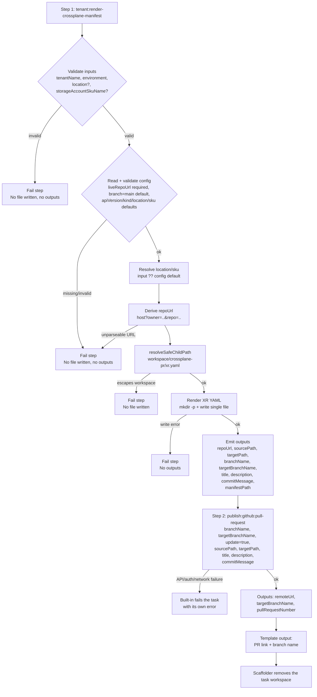

# Design Document

## Overview

Tenant provisioning against the Crossplane live repository is delivered as a **two-step Software
Template**: a thin custom action that owns the domain logic, and Backstage's built-in
`publish:github:pull-request` action that owns the git and pull-request work.

```
Template tenant-provisioning-crossplane
  step 1  tenant:render-crossplane-manifest   (custom, this module)
            validate inputs -> read config -> render xr.yaml into the task workspace
            -> emit repoUrl / sourcePath / targetPath / branchName / targetBranchName
               / title / description / commitMessage
  step 2  publish:github:pull-request         (built-in, @backstage/plugin-scaffolder-backend-module-github)
            create-or-update branch + commit + pull request via the GitHub API
```

The custom action lives in the existing module
`@internal/backstage-plugin-platform-backend-module-tenant-provisioning-crossplane`
(`plugins/platform-backend-module-tenant-provisioning-crossplane/`), registered in
`packages/backend/src/index.ts`.

> ## Revision: from one monolithic action to the hybrid split
>
> The first implementation put clone, write, branch, commit, push, and pull request in a single custom
> action (`tenant:provision-crossplane`) backed by `isomorphic-git` and `@octokit/rest`, plus its own
> temporary-workspace manager and secret-redaction helper. This design supersedes that. What changes:
>
> | Previously in this module | Now |
> | --- | --- |
> | `git.ts` — clone/branch/commit/push, PR create/lookup, error classification, timeouts, auth (509 lines) | Deleted. `publish:github:pull-request` does all of it through the GitHub API. |
> | `workspace.ts` — `mkdtemp` inside `ctx.workspacePath`, `resolveWithin`, verified `cleanup` (111 lines) | Deleted. The scaffolder already creates one workspace per task and removes it; path confinement uses `resolveSafeChildPath` from `@backstage/backend-plugin-api`. |
> | `redact.ts` — strip the token out of surfaced messages | Deleted. The action never handles a token, so there is nothing to redact. |
> | `naming.buildBranchName(tenant, env, date)` → `devops/<t>-<e>-<yyyymmdd-hhmmss>` | `buildBranchName(tenant, env)` → `devops/<t>-<e>`, deterministic, paired with the built-in's `update: true`. |
> | Action id `tenant:provision-crossplane`, which provisioned end to end | Action id `tenant:render-crossplane-manifest`, which only renders and emits wiring values. The Template provisions. |
> | Runtime deps `isomorphic-git`, `@octokit/rest` | Removed from the module. |
>
> Unchanged: `config.ts`, `manifest.ts`, `components.ts` (disabled), the rendered XR shape, and the
> `tenants/<tenant>/<environment>/xr.yaml` layout in the live repo.
>
> Why the branch name loses its timestamp: with a timestamp, every submission for the same tenant and
> environment produced a *new* branch, so the old code's "reuse the already-open pull request" path was
> unreachable and repeated submissions piled up open pull requests. A deterministic branch plus
> `update: true` gives one open pull request per tenant/environment that later submissions update.

**Hard boundary:** neither step runs `crossplane`, `kubectl apply`, or any cluster/cloud execution — in
production, tests, or CI (Req 5.5, `AGENTS.md`).

**Components disabled (retained for re-enable).** An earlier iteration expanded Selected_Components
against Allowed_Components and rendered `spec.<component>.enabled` blocks. That path is retained in
`components.ts`, config, and tests but **not emitted**: the renderer's emit loop is commented, the
Template's `components` parameter/step input is commented, and the manifest carries no component
blocks. Re-enable by uncommenting those marked seams.

Requirement coverage: registration + input/config schema (Req 1), delegation of repo access (Req 2),
render + write (Req 3), deterministic branch + commit wiring (Req 4), pull request (Req 5), workspace
lifecycle (Req 6), secret avoidance (Req 7), fail-fast validation (Req 8), extensible components
(Req 9, disabled).

## Module layout

| File | Responsibility | Status |
| --- | --- | --- |
| `actions/renderCrossplaneManifest.ts` | Action factory + handler: validate, render, write, emit outputs | rewritten (was `tenantProvisionCrossplane.ts`) |
| `config.ts` | Read/validate the `crossplaneProvisioning` config block | unchanged |
| `manifest.ts` | Pure renderer → `XTenantEnvironment` XR YAML | unchanged |
| `naming.ts` | `buildBranchName` (`devops/<t>-<e>`), `buildPullRequestTitle`, `buildCommitMessage`, `buildPullRequestDescription` | revised |
| `repoUrl.ts` | `buildScaffolderRepoUrl(liveRepoUrl)` → `<host>?owner=<owner>&repo=<repo>` | new (absorbs `parseGithubOwnerRepo` from the deleted `git.ts`) |
| `components.ts` | `expandComponents(selected, allowed)` | unchanged (disabled) |
| `module.ts` | Registers `tenant:render-crossplane-manifest` (`moduleId: 'tenant-provisioning-crossplane'`) | revised (id only) |
| `config.d.ts` | Schema declaration for the `crossplaneProvisioning` block | unchanged |
| `index.ts` | Module export point | unchanged |
| ~~`git.ts`~~ | — | **deleted** |
| ~~`workspace.ts`~~ | — | **deleted** |
| ~~`redact.ts`~~ | — | **deleted** |

## Research notes

All facts below were read from the installed packages in this repo, not from memory.

- **`publish:github:pull-request` is already available.**
  `@backstage/plugin-scaffolder-backend-module-github` is at version `0.9.12` and is registered at
  `packages/backend/src/index.ts:19`, so no new dependency or backend wiring is required.
- **It needs no clone.** Its handler resolves `fileRoot` as
  `resolveSafeChildPath(ctx.workspacePath, sourcePath)`, serializes it with
  `serializeDirectoryContents(fileRoot, { gitignore: true })`, and hands the resulting file map to
  `octokit-plugin-create-pull-request`'s `createPullRequest`. Branch, commit, and pull request are all
  GitHub API calls. (Source: `dist/actions/githubPullRequest.cjs.js`. Rephrased for licensing
  compliance.)
- **Its inputs.** Required: `repoUrl`, `branchName`, `title`, `description`. Optional and relevant
  here: `targetBranchName` (pull request base; when omitted the repository default branch is used),
  `sourcePath` (workspace subdirectory to take files from), `targetPath` (repository subdirectory to
  apply them to), `commitMessage`, `update`, `draft`, `filesToDelete`, `reviewers`, `teamReviewers`,
  `assignees`, `createWhenEmpty`, `gitAuthorName`/`gitAuthorEmail`, `forceFork`, `token`.
- **Its `repoUrl` form** is `<host>?owner=<owner>&repo=<repo>` (for example
  `github.com?owner=acme&repo=adp-gitops-tenants`), parsed with `parseRepoUrl(repoUrl, integrations)`;
  the host must be a configured integration host.
- **Its outputs** are `targetBranchName`, `remoteUrl` (the pull request HTML URL), and
  `pullRequestNumber`.
- **`update: true`** is forwarded to `createPullRequest`, which updates the existing branch and pull
  request rather than failing on a duplicate — this is what makes the deterministic branch name safe.
- **Commit message fallback** is `commitMessage ?? config.scaffolder.defaultCommitMessage ?? title`;
  this design always passes an explicit `commitMessage`.
- **Credentials** come from the action's `githubCredentialsProvider` over `integrations.github`
  (`token: ${GITHUB_TOKEN}`), or from an explicit `token` input. This design passes no `token`, so the
  integration config is the single source.
- **The scaffolder owns the workspace.** `NunjucksWorkflowRunner` computes
  `workspacePath = path.join(workingDirectory, taskId)` (line 423) and `fs.remove(workspacePath)` when
  the task finishes (line 547). A module-level temporary directory would duplicate this.
- **Target API.** `XTenantEnvironment` is a Crossplane composite resource (XR):
  `apiVersion: adp.example.org/v1alpha1`, `kind: XTenantEnvironment`, cluster-scoped. Spec:
  `tenantName`, `environment` (`dev|staging|prod`), `location` (Azure region),
  `storageAccountSkuName` (Azure Storage SKU). No `compositionRef` is written: composition selection
  is left to Crossplane's default-composition resolution for the XRD.
  Manifests live at `tenants/<tenant>/<env>/xr.yaml` with `metadata.name` `<tenant>-<env>` and no
  `metadata.namespace`.
- **Config vs env.** Values are `${ENV_VAR}` references in `app-config*.yaml`, read via
  `coreServices.rootConfig` (Req 1.9).
- **YAML rendering.** A pure builder produces a plain object with fixed key order; `yaml.stringify`
  serializes it, giving byte-for-byte identical output per input (Req 3.9).
- **Step id naming.** The Backstage template docs warn that step ids containing dashes break
  `${{ steps.my-step.output.x }}` expressions. The Template therefore uses camelCase step ids
  (`renderManifest`, `createPullRequest`).

## Architecture

### Responsibility split

| Concern | Owner |
| --- | --- |
| Input validation, tenant/environment rules | Render_Action |
| Reading `crossplaneProvisioning` config, resolving Azure defaults | Render_Action |
| Rendering the XR manifest, path confinement inside the workspace | Render_Action |
| Deriving repoUrl / branch / paths / titles from config + inputs | Render_Action |
| Branch creation, commit, push, pull request create-or-update | `publish:github:pull-request` |
| GitHub authentication | `publish:github:pull-request` + `integrations.github` |
| Workspace creation and deletion | Scaffolder_Backend |
| Composing the two steps and surfacing outputs | Template |

### Module wiring

```
packages/backend/src/index.ts
  ├─ backend.add(import('@backstage/plugin-scaffolder-backend-module-github'))   // existing — provides step 2
  ├─ backend.add(import('@internal/...-tenant-provisioning'))                    // existing Terragrunt — unchanged
  └─ backend.add(import('@internal/...-tenant-provisioning-crossplane'))         // existing line — unchanged
        └─ platformModuleTenantProvisioningCrossplane (createBackendModule)
              └─ registerInit deps: scaffolder (scaffolderActionsExtensionPoint),
                 config (coreServices.rootConfig), logger (coreServices.logger)
              └─ init: scaffolder.addActions(createRenderCrossplaneManifestAction({ config, logger }))
```

`pluginId: 'scaffolder'`, `moduleId: 'tenant-provisioning-crossplane'`.

### Execution flow



Validation and config resolution happen before the first `mkdir`/`writeFile`, so a failing step leaves
the workspace untouched and emits no outputs; because step 2 consumes step 1's outputs, a failed step 1
means no branch, no commit, and no pull request (Req 8.4). There is no `try/finally` cleanup block: the
scaffolder deletes the workspace either way (Req 6.2).

## Components and Interfaces

### 1. Action factory — `createRenderCrossplaneManifestAction`

`src/actions/renderCrossplaneManifest.ts`.

```ts
export type Environment = 'dev' | 'staging' | 'prod';

export interface RenderCrossplaneManifestInput {
  tenantName: string;
  environment: Environment;
  location?: string;              // Azure region; defaults to config.defaultLocation
  storageAccountSkuName?: string; // Azure Storage SKU; defaults to config.defaultStorageAccountSkuName
  selectedComponents?: string[];  // DISABLED — retained; not emitted while components are off
}

export interface RenderCrossplaneManifestOutput {
  repoUrl: string;          // '<host>?owner=<owner>&repo=<repo>' for publish:github:pull-request
  sourcePath: string;       // workspace subdirectory holding the rendered manifest
  targetPath: string;       // 'tenants/<tenant>/<environment>' in the live repo
  manifestPath: string;     // 'tenants/<tenant>/<environment>/xr.yaml' — for display only
  branchName: string;       // 'devops/<tenant>-<environment>'
  targetBranchName: string; // configured live repo base branch
  title: string;            // pull request title
  description: string;      // pull request body
  commitMessage: string;    // commit message
}

export function createRenderCrossplaneManifestAction(options: {
  config: RootConfigService;
  logger: LoggerService;
}): TemplateAction<RenderCrossplaneManifestInput, RenderCrossplaneManifestOutput>;
```

- Action id: `tenant:render-crossplane-manifest`; `supportsDryRun: true` (it only writes into the
  workspace, so the Template Editor's dry run exercises it safely).
- Zod input: `tenantName` matches `^[a-z0-9]([a-z0-9-]{1,20})[a-z0-9]$`; `environment` ∈
  `dev|staging|prod`; `location` optional enum of the supported region set; `storageAccountSkuName`
  optional enum of the supported Azure Storage SKUs; `selectedComponents` optional `string[]`
  (retained, disabled).
- Handler order: validate inputs → read config → resolve location/sku → derive repoUrl → resolve the
  confined target path → render → `mkdir` + `writeFile` (exactly one file) → emit outputs.
- `SOURCE_DIRECTORY = 'crossplane-pr'` is a module constant, emitted as `sourcePath` so the Template
  does not hardcode it. Nothing else is written into it, which is what makes the built-in commit
  exactly one file (Req 3.10).
- No token, no network, no child process, no temporary directory.

### 2. ConfigReader — `readCrossplaneProvisioningConfig`

`src/config.ts`. **Unchanged** from the current implementation.

```ts
export interface CrossplaneProvisioningConfig {
  liveRepoUrl: string;                  // ${CROSSPLANE_LIVE_REPO_URL}; required, non-empty
  liveRepoBranch: string;               // ${CROSSPLANE_LIVE_REPO_BRANCH}; default 'main'
  apiVersion: string;                   // default 'adp.example.org/v1alpha1'
  kind: string;                         // default 'XTenantEnvironment'
  defaultLocation: string;              // default 'japaneast'
  defaultStorageAccountSkuName: string; // default 'Standard_LRS'
  allowedComponents: string[];          // crossplaneProvisioning.components; default ['table','repository'] (disabled)
}
```

| Rule | Requirement |
| --- | --- |
| `liveRepoBranch` defaults to `main` | 1.7 |
| `apiVersion`/`kind` default to `adp.example.org/v1alpha1` / `XTenantEnvironment` | 1.11 |
| `defaultLocation`/`defaultStorageAccountSkuName` default as above | 1.10 |
| `components` defaults to `['table','repository']` (disabled) | 1.12 |
| Fail (key-naming error) when `liveRepoUrl` absent/empty | 1.8 |
| Reject allowed name not matching `^[a-z0-9_]+$` | 9.7 |
| Reject allowed set > 100 entries | 9.8 |

### 3. ManifestRenderer — `renderTenantEnvironmentManifest`

`src/manifest.ts`. **Unchanged** from the current implementation: pure function, builds an ordered
object, serializes with `yaml.stringify`.

```yaml
apiVersion: adp.example.org/v1alpha1
kind: XTenantEnvironment
metadata:
  name: acme-dev
spec:
  tenantName: acme
  environment: dev
  location: japaneast
  storageAccountSkuName: Standard_LRS
```

`metadata.name` = `<tenantName>-<environment>`; no `metadata.namespace`. The
`spec.<component>.enabled` emit loop stays commented out (Req 3.3 DISABLED), with its `^[a-z0-9_]+$`
and >100-entry checks retained. Newline-bearing scalars are rejected before output; output is
deterministic (Req 3.9).

### 4. `repoUrl.ts` — `buildScaffolderRepoUrl`

```ts
export function buildScaffolderRepoUrl(liveRepoUrl: string): string;
```

Pure. Parses `https://<host>/<owner>/<repo>(.git)` and returns `<host>?owner=<owner>&repo=<repo>`,
the form `publish:github:pull-request` expects. Throws a message naming
`crossplaneProvisioning.liveRepoUrl` when the URL cannot be parsed or lacks an owner/repo pair. This
keeps the live repo URL config-driven (Req 1.9) instead of pasting a `repoUrl` literal into
`template.yaml`. The owner/repo parsing is carried over from the deleted `git.ts`.

### 5. `naming.ts`

```ts
export function buildBranchName(tenantName: string, environment: Environment): string;        // devops/<t>-<e>
export function buildPullRequestTitle(tenantName: string, environment: Environment): string;
export function buildCommitMessage(tenantName: string, environment: Environment): string;
export function buildPullRequestDescription(input: {
  tenantName: string; environment: Environment; location: string;
  storageAccountSkuName: string; manifestPath: string;
}): string;
```

All pure. `buildBranchName` no longer takes a `Date` (Req 4.1). The title and commit message each
contain the tenant name and the environment (Req 4.3, 5.3). The description summarises the rendered
values so a reviewer sees the change without opening the diff; `description` is a required input of
the built-in action.

### 6. Backend module — `platformModuleTenantProvisioningCrossplane`

`src/module.ts`. `createBackendModule({ pluginId: 'scaffolder', moduleId: 'tenant-provisioning-crossplane' })`;
`registerInit` deps `{ scaffolder, config, logger }`; init calls
`scaffolder.addActions(createRenderCrossplaneManifestAction({ config, logger }))`. The
`backend.add(...)` line in `packages/backend/src/index.ts` is unchanged.

### 7. Template — `templates/tenant-provisioning-crossplane/template.yaml`

Parameters are unchanged:

| Parameter | Type | Notes |
| --- | --- | --- |
| `tenantName` | string | pattern `^[a-z0-9]([a-z0-9-]{1,20})[a-z0-9]$` |
| `environment` | string | enum `dev|staging|prod`, default `dev` |
| `location` | string | enum `[japaneast, japanwest, southeastasia]`, default `japaneast` |
| `storageAccountSkuName` | string | enum `[Standard_LRS, Standard_GRS, Standard_RAGRS, Standard_ZRS, Premium_LRS]`, default `Standard_LRS` |
| `components` *(DISABLED)* | array/enum | `[table, repository]`, `ui:widget: checkboxes` — commented out |

Steps:

```yaml
steps:
  - id: renderManifest
    name: Render tenant XTenantEnvironment manifest
    action: tenant:render-crossplane-manifest
    input:
      tenantName: ${{ parameters.tenantName }}
      environment: ${{ parameters.environment }}
      location: ${{ parameters.location }}
      storageAccountSkuName: ${{ parameters.storageAccountSkuName }}
      # DISABLED — retained: selectedComponents: ${{ parameters.components }}

  - id: createPullRequest
    name: Open pull request against the Crossplane live repo
    action: publish:github:pull-request
    input:
      repoUrl: ${{ steps.renderManifest.output.repoUrl }}
      branchName: ${{ steps.renderManifest.output.branchName }}
      targetBranchName: ${{ steps.renderManifest.output.targetBranchName }}
      sourcePath: ${{ steps.renderManifest.output.sourcePath }}
      targetPath: ${{ steps.renderManifest.output.targetPath }}
      title: ${{ steps.renderManifest.output.title }}
      description: ${{ steps.renderManifest.output.description }}
      commitMessage: ${{ steps.renderManifest.output.commitMessage }}
      update: true
```

Output links to `steps.createPullRequest.output.remoteUrl` and shows the branch name, manifest path,
location, and SKU. Registered under `catalog.locations` in `app-config.yaml` (unchanged).

### 8. App-config block

Unchanged:

```yaml
crossplaneProvisioning:
  liveRepoUrl: ${CROSSPLANE_LIVE_REPO_URL}                       # required
  liveRepoBranch: ${CROSSPLANE_LIVE_REPO_BRANCH}                 # optional; defaults to main
  apiVersion: adp.example.org/v1alpha1                           # optional; default shown
  kind: XTenantEnvironment                                       # optional; default shown
  defaultLocation: japaneast                                     # optional; default shown
  defaultStorageAccountSkuName: Standard_LRS                     # optional; default shown
  components: [table, repository]                                # Allowed_Components (DISABLED; retained)
```

`GITHUB_TOKEN` is consumed by the built-in action through `integrations.github`; it needs contents
write and pull-request write on the live repo. No AWS/Azure credentials are required (PR only).

## Error Handling

- Validation and config errors fail step 1 before any file is written (Req 8, 3.8).
- Path escape attempts are rejected by `resolveSafeChildPath` before any I/O (Req 3.7, 7.5).
- An unparseable `crossplaneProvisioning.liveRepoUrl` fails step 1 with a message naming that config
  key.
- Git, authentication, rate-limit, and pull-request errors are raised and reported by
  `publish:github:pull-request` itself; this module does not catch, wrap, or reclassify them (Req 2.4).
- Because step 1 handles no secret, no redaction layer is needed (Req 7.1).

## Testing Strategy

No test performs a network operation, and none runs `crossplane`/`kubectl` (Req 5.5).

- **Property-based** (`fast-check`, ≥100 iterations, tagged
  `Feature: tenant-provision-crossplane, Property N: <text>`):
  - **P1 Manifest round-trip** — unchanged: parse the rendered YAML and assert `apiVersion`/`kind`/
    `metadata.name`, absence of `metadata.namespace`, the five `spec` keys, and determinism (Req 3).
  - **P2 Branch name is well-formed and deterministic** — revised: matches
    `^devops/[a-z0-9-]{3,22}-(dev|staging|prod)$`, and two calls with the same inputs are equal
    (Req 4.1). The old timestamp assertions are removed.
  - **P3 Workspace confinement** — revised to target the action's `resolveSafeChildPath` usage:
    tenant/environment values biased toward `..`, `/`, and absolute prefixes either resolve inside the
    workspace or fail (Req 3.7, 7.4, 7.5).
  - **P4 Invalid input is rejected with no side effects** — revised: the action fails and no file is
    created anywhere under the workspace, and no output is emitted (Req 1.4, 8.1-8.4).
  - **P7 Pull request title identifies tenant and environment** — unchanged (Req 5.3), extended to the
    commit message (Req 4.3).
  - **P9 Component expansion** — retained, unchanged (Req 9, disabled).
  - **New: repoUrl round-trip** — for generated `https://<host>/<owner>/<repo>` URLs,
    `buildScaffolderRepoUrl` yields `<host>?owner=<owner>&repo=<repo>`; malformed URLs throw naming the
    config key.
  - **Removed: P5 (redaction), P6 (working-directory uniqueness)** — their subjects no longer exist.
  - **P8 Deterministic rendering** — unchanged (Req 3.9).
- **Unit/integration:**
  - `config.test.ts` — unchanged (defaults, missing `liveRepoUrl`, component validation).
  - `renderCrossplaneManifest.test.ts` — happy path writes exactly one file at
    `<workspace>/crossplane-pr/xr.yaml`, its content is the expected XR, and every output value is
    emitted with the expected shape (Req 3.4, 3.10, 4.1-4.3, 5.3); `location`/`storageAccountSkuName`
    fall back to config defaults (Req 1.5); a write failure fails the step and emits no output
    (Req 3.8).
  - `module.test.ts` — the module registers an action with id `tenant:render-crossplane-manifest`
    (Req 1.1, 1.2).
  - **New: template wiring test** — parse `templates/tenant-provisioning-crossplane/template.yaml` and
    assert step 2 is `publish:github:pull-request`, that `update` is `true`, and that every one of its
    inputs references an output of step 1 (Req 4.2, 4.4, 5.1, 5.2). This is the only place the
    two-step contract is verified, since the built-in action is not ours to test.
  - **Deleted: `git.test.ts`, `workspace.test.ts`, `redact.property.test.ts`** — their subjects are
    deleted.
- **Safety/hygiene:** no child-process, no `crossplane`/`kubectl`, and no HTTP client is reachable from
  the action (Req 5.5, 2.3); the module's `package.json` no longer lists `isomorphic-git` or
  `@octokit/rest` (Req 2.1); the rendered manifest contains no token (Req 7.3).

## Design Decisions and Trade-offs

| Decision | Rationale |
| --- | --- |
| Split into a custom render step + built-in PR step | The git/PR half was ~900 lines of infrastructure code with no domain value, and the most failure-prone part of the module. Backstage maintains an equivalent. |
| Keep validation, config, rendering, and naming custom | The built-in knows nothing about tenants, environments, XR shape, or the `tenants/<t>/<e>/xr.yaml` layout. This is the part worth owning. |
| Emit `repoUrl`/`targetBranchName` from the action instead of putting them in the Template | Preserves Req 1.9 (config-driven, `${ENV_VAR}`-backed) — the live repo URL and base branch stay out of `template.yaml`. |
| Deterministic branch + `update: true` | One open pull request per tenant/environment that later submissions update, instead of a new branch and pull request per submission. Also makes pull-request idempotency real rather than dead code. |
| Dedicated `sourcePath` subdirectory | `serializeDirectoryContents` commits everything under `sourcePath`; isolating the manifest guarantees a single-file commit. |
| Rename the action to `tenant:render-crossplane-manifest` | The action no longer provisions or opens a pull request; the Template does. An id that overstates the behaviour would mislead future template authors. |
| No redaction layer | The action handles no secret, which is a stronger guarantee than redacting one. |
| Drop the self-managed temp directory | The scaffolder already creates and removes one workspace per task; a second layer added cleanup failure modes without benefit. |
| PR is the hard boundary | No cluster apply anywhere, including tests/CI. |
